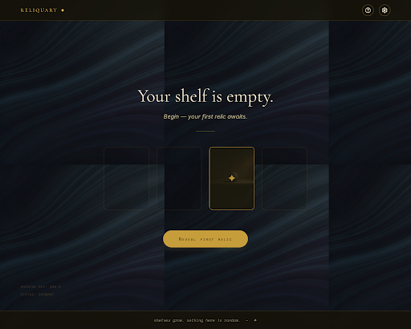

# S01 — Empty Shelf

**Journey:** A · beat 1 (cold-landing → curiosity)
**Status:** ✅ Stitch-generated (first pass)
**Generated:** 2026-05-20
**Stitch project:** `17652338204408695000` / screen `830aceb930574048b441f565d643dc2d`

---

## Mockup

**Assets:**
- HTML: [`.stitch/designs/S01-empty-shelf.html`](../../.stitch/designs/S01-empty-shelf.html)
- Screenshot: [`.stitch/designs/S01-empty-shelf.png`](../../.stitch/designs/S01-empty-shelf.png)

---

## What Stitch produced

- **Header (translucent, fixed top):** "RELIQUARY" wordmark + small ✦ glyph on the left in display serif small-caps; help and settings icon buttons on the right, hairline gold borders, no fills.
- **Hero:** "Your shelf is empty." in 56px Cormorant Garamond, with italic subhead "Begin — your first relic awaits." beneath. A 60px antique-gold hairline separates the subhead from the shelf.
- **The shelf:** four portrait card slots (5:7 ratio) arranged horizontally. Slots 1, 2, 4 are dim with hairline dim-gold borders and a faint diagonal-hatch inner texture. Slot 3 is active — antique-gold border, ✦ glyph centered inside, warm radial glow extending outward.
- **Primary CTA:** pill-shaped "Reveal first relic" button in antique gold, surface-black text, generous padding, beneath the shelf.
- **Footer (translucent, fixed bottom):** italicized hint *"shelves grow. nothing here is random. — ✦"* in Space Mono, worn parchment color at reduced opacity.
- **Background:** dark warm surface with subtle vertical-wave grain — a quiet pattern that suggests aged paper or candle-soot, never decorative.

---

## How it consumes the design system

| Element | Token |
|---------|-------|
| Page background | `--color-surface` (#0b0a08) |
| Header / footer surface | `--color-surface-raised` (#15130f) |
| Wordmark + ✦ glyph | `--color-ink` (#f4ead5), Cormorant Garamond small-caps |
| Headline "Your shelf is empty." | `--color-ink-strong` (#ebe2cd), `--text-display-xl` |
| Italic subhead | `--color-ink-muted` (#c2b893), Inter italic, `--text-body-l` |
| Hairline rule | `--color-accent` (#c89f3c), 60px wide, 1px |
| Inactive slot border | `--color-accent-soft` (#5a4318), 1px |
| Active slot border | `--color-accent` (#c89f3c), 1.5px |
| Active slot glow | `--color-accent-bright` (#edc15a) at 30%, 24px radial, pulse `--motion-pulse` |
| Primary CTA fill | `--color-accent` (#c89f3c) |
| Primary CTA text | `--color-surface` (#0b0a08) |
| Footer hint | `--color-ink-muted` (#c2b893), Space Mono italic at 70% opacity, `--text-mono-m` |

---

## Wireframe provenance

Derived from **`STORYBOARD.md` §5 → S01** (Empty Shelf wireframe, dated 2026-05-20). The Stitch generation prompt referenced:
- The premise from `STORYBOARD.md` §1
- The aesthetic anchor from `BRAINSTORM.md` §3 (Theme block — modern-museum × quiet-occult)
- The voice from `BRAINSTORM.md` §3 (curatorial-mythic)
- The exact pixel rhythms from the wireframe

**Faithful to wireframe?** Yes — header, headline, subhead, gold rule, 4-slot shelf with active slot #3, gold CTA, italic Space-Mono footer hint. Stitch added a faint vertical-wave grain to the surface (interpretation, not a deviation — flagged as acceptable).

---

## Interactive contract (when implemented)

| Element | Behavior |
|---------|----------|
| `[ Reveal first relic ]` (primary CTA) | `POST /pull/first` → opens S02 modal. Focus auto-set on mount. Enter/Space activates. |
| Glowing slot #3 | Same action as CTA. aria-label: `Begin — reveal your first relic`. Tab-focusable. |
| `[?]` icon | Opens a 1-paragraph "what is this" overlay. aria-label: `What is Reliquary`. |
| `[⚙]` icon | Opens settings (sound, motion, contrast). aria-label: `Settings`. |
| Pulse animation | `--motion-pulse` (1.4s ease-in-out, opacity 30% → 0). Disabled under `prefers-reduced-motion`. |

---

## Acceptance gates for implementation

- [ ] Implemented against `.stitch/DESIGN.md` tokens only (no hand-rolled hex codes).
- [ ] WCAG AA verified — Stitch-checked at design-time, re-checked in-browser via agent-browser.
- [ ] Keyboard-navigable end-to-end.
- [ ] `prefers-reduced-motion` honored (pulse → static).
- [ ] agent-browser screenshot saved under `dogfood-output/<UTC>/S01-rendered.png`.
- [ ] Diff against this mockup ≤ minor (typography rendering, font hinting allowed).

---

## Decisions captured

- **Background grain pattern**: Stitch added a vertical-wave grain. Decision: accept. It reinforces the "aged paper" feel without becoming decorative pattern.
- **Slot count**: 4 visible at desktop 1440×900 (originally I described "4–5"). Stitch picked 4. Decision: accept — keeps the symmetry of "two on each side of the glowing one" tight.
- **Slot active glyph**: a ✦ inside the slot (matching the wordmark glyph). Decision: accept — creates a recursive identity (the wordmark glyph is the symbol of "where to begin").
