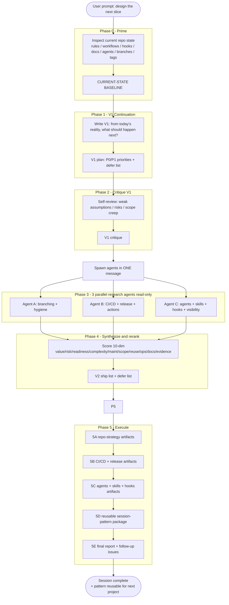
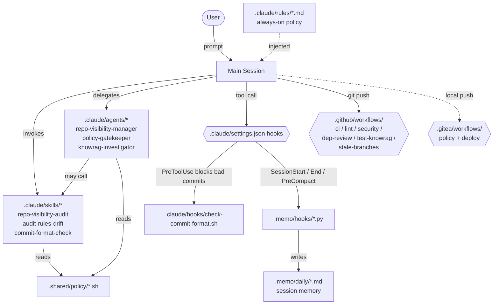

# Session Pattern — Repo Strategy & CI/CD Layer

> Captured from the 2026-05-07 W7-Base session. This pattern is **reusable for any operator-grade repo** that needs to land a unified branching + CI/CD + agents/skills/hooks layer without a sprawling redesign.
>
> Companion artifacts in this directory:
> - `DIAGRAMS/01-workflow.mmd` — the 5-phase workflow as a flowchart
> - `DIAGRAMS/02-interaction-model.mmd` — how rules / agents / skills / hooks interact
> - `SOURCES.md` — every external link cited, with accessed-on dates and refresh notes

## Why this pattern exists

When a repo grows past "one person, no CI, no rules", you suddenly need:
- a branching model
- a release strategy
- a security baseline in CI
- a small bench of specialist agents/skills/hooks
- public-facing docs that don't rot

It is tempting to attack all of this in one sprawling brainstorm. That produces a 200-line plan that gets half-shipped. **This pattern enforces continuation discipline** — it grounds in current reality first, then escalates to research only after a V1 plan exists.

## When to use this pattern

Use it when:
- The repo already has *some* rules / CI / docs, but they have drifted from current scope (DevSync-style drift, deprecated SQL migrations, Phase-N legacy prose).
- You want a single session to land 20+ artifacts that all conform to the same policy surface.
- You want the resulting work to be repeatable on the next repo without re-doing the research from scratch.
- You're operating in **auto mode** — the user expects continuous execution with low interruption.

Don't use it when:
- The repo is < 1 week old (no rules to drift from yet).
- You only need one artifact (it's overkill).
- The task is purely investigative — use a single Explore-style agent instead.

## The workflow (5 phases, strict order)



### Phase 0 — Prime

Inspect, don't recommend. Read these before forming any opinion:
- Existing rules (`.claude/rules/`, sub-project equivalents)
- Existing CI / CD surface (`.github/workflows/`, `.gitea/workflows/`, etc.)
- Existing hooks (`settings.json`, hook scripts)
- Existing agents/skills (`.claude/agents/`, `.claude/skills/`, `.claude/commands/`)
- Public surface (`README.md`, `llms.txt`, `AGENTS.md`, `docs/`)
- Branch + tag state (`git log`, `git tag`, `gh pr list`, `gh release list`)
- Issue conventions (`gh issue list`)

Output: a **current-state baseline** with rule/workflow/hook/doc inventories + a hygiene-gap table. No recommendations yet.

### Phase 1 — V1 Continuation Plan

Without doing any web research, write the plan that a reasonable human would write **knowing only what the baseline shows**. Cover:
- What exists and can be reused
- What is missing
- What is conflicting
- Safest order of operations
- Root vs sub-project split
- What V1 explicitly defers to research

Output: a single V1 plan in markdown, with a P0/P1/P2 priority column.

### Phase 2 — Critique V1

Self-review with these heads on:
- **Weak assumptions** — what does V1 take as given that might not be?
- **Risks / blockers** — what could fail?
- **Missing context** — what does V1 *not know* yet?
- **Scope-creep watch list** — explicit "do NOT do" items
- **Over-engineering risk** — where is V1 likely to bloat?
- **In-session vs follow-up split** — what to ship, what to file

Output: a critique that turns V1 into a research brief for Phase 3.

### Phase 3 — Three parallel research agents (read-only)

Spawn three agents **in a single message with three concurrent Agent tool calls**. Read-only; reports only; no Write/Edit.

| Agent | Scope | Output |
|-------|-------|--------|
| A | Branching + repo hygiene | `BRANCHING.md` outline + delta list for existing rules |
| B | CI/CD + release + GH Actions | Workflow file plan + release-tool decision + KPIs |
| C | Agents/skills/hooks + visibility manager | Agent files + skill stubs + hook plan + interaction model |

Each agent receives:
- A self-contained brief (do NOT assume conversation context).
- The verified baseline from Phase 0.
- A read-only constraint.
- Length cap (~800–900 words) + a sources table requirement.

### Phase 4 — Synthesize, score, rerank → V2

Compare V1 vs the three agent reports. Score each candidate artifact across **10 dimensions** (1–5 scale):

```
Value | Risk | Readiness | Complexity | Maintainability |
ScopeFit | Reusability | OpsBurden | DocBurden | Evidence
```

Sum the scores; sort. Anything below ~36 should be deferred. Anything 40+ ships now.

Output: V2 ship list (organized by family A/B/C/D) + deferred follow-up issues + a scope-discipline guard.

### Phase 5 — Execute

Five sub-phases in order. Mark each task complete as it ships.

- **5A** — Repo-strategy artifacts (rules, CLAUDE.md, BRANCHING.md, CODEOWNERS, PR + issue templates, branch-naming.md, versioning.md)
- **5B** — CI/CD + release artifacts (workflows, RELEASE.md, dependabot.yml, Gitea trim)
- **5C** — Agents + skills + hooks (full file content from Agent C; PreToolUse hook for commit-format)
- **5D** — Reusable session-pattern package (this directory + a skill stub at `~/.claude/skills/`)
- **5E** — Final scannable report + follow-up issue stubs

Hard rules during execution:
- Validate every Mermaid diagram via `mcp__claude_ai_Mermaid_Chart__validate_and_render_mermaid_diagram` **before** writing the `.mmd` file.
- Conform every artifact to the rewritten `commit-format.md` and `output-formatting.md`.
- Never paste a secret value; reference key names only.
- File a follow-up issue rather than half-implement.

## Interaction model (what the artifacts produce)



## How to re-run this pattern on a new project

1. **Open** `~/.claude/skills/repo-strategy-session/SKILL.md` and read the kickoff prompt.
2. Pin the current date as the session-pattern slug: `docs/_session-patterns/<YYYY-MM-DD-slug>/`.
3. Copy the workflow above. The phase order is non-negotiable.
4. Adapt the **Phase 0 inspection list** to the target repo (different repos have different existing surface).
5. Adapt the **three agent briefs** — same scopes, but inline the target repo's specifics (zone shape, language mix, existing rules, existing CI).
6. The 10-dim scoring rubric stays. The threshold (≥40 ships, <36 defers) is a starting point — tune per repo.
7. Update `SOURCES.md` per the "How to refresh" notes — research from May 2026 has a shelf life of ~12 months for branching, ~6 months for CI/security, ~3 months for agent/skill schemas.

## Anti-patterns to reject

- **"Let's start with the research."** No. Prime first. The baseline is the source of truth — research without it is hallucinated best-practice.
- **"Let's combine V1 and V2 into one plan."** No. The two passes have different jobs: V1 is continuation, V2 is informed refinement. Collapsing them loses the grounding.
- **"Let's spawn 5 research agents."** No. Three is the cap; more agents = more synthesis cost without proportionally more signal. Add a 4th only if the topic is genuinely orthogonal (e.g., compliance/legal).
- **"Let's give each research agent write access."** No. Read-only is non-negotiable — it prevents agents stomping on each other and forces the main session to own integration.
- **"Let's skip the scoring rubric and pick by gut."** No. The 10-dim score is the only thing that prevents Phase 4 from becoming a brainstorm of its own. Skip it and you'll ship 35 artifacts where 24 was right.
- **"Let's not file follow-up issues — we'll remember."** You won't. File the issue.

## Outputs of the 2026-05-07 run (concrete instance of this pattern)

- **5A** — 14 files (4 rule rewrites/patches, root `CLAUDE.md`, `BRANCHING.md`, 2 new rules, `CODEOWNERS`, PR template, 4 issue templates).
- **5B** — 7 new files (4 workflows, `dependabot.yml`, `RELEASE.md`) + 1 trim (`.gitea/workflows/validate.yaml` lost the duplicate `compose-config` job).
- **5C** — 8 files (3 agents, 3 skills, 1 hook script, `settings.json` extension).
- **5D** — this directory (`PATTERN.md`, two `.mmd`, `SOURCES.md`) + `~/.claude/skills/repo-strategy-session/SKILL.md`.
- **5E** — final report (in the session's last assistant turn) + follow-up issue stubs listed there.

Total: ~30 artifacts shipped. Total session time: ~one auto-mode pass.

## Reusable inventories (cross-project)

These tables stay stable across projects. Adapt the cells, keep the columns.

### Phase-0 inspection checklist
| Area | Where to look |
|------|---------------|
| Rules | `.claude/rules/`, `**/.claude/rules/`, root `CLAUDE.md`, root `AGENTS.md` |
| CI surface | `.github/workflows/`, `.gitea/workflows/`, `.shared/workflows/`, `.gitlab-ci.yml`, `.circleci/`, `azure-pipelines.yml` |
| Hooks | `.claude/settings.json`, `.claude/hooks/`, sub-project equivalents |
| Agent ecosystem | `.claude/agents/`, `.claude/skills/`, `.claude/commands/` |
| Public surface | `README.md`, `llms.txt`, `AGENTS.md`, `docs/`, badges |
| Branch + tag state | `git log --oneline --all`, `git tag`, `gh pr list`, `gh release list` |
| Issue conventions | `gh issue list --state all`, last 20 |

### Defer list (always-defer until justified)
- Release-please/changesets installation (defer until ≥3 manual tags cut)
- CodeQL setup (defer if Bash-heavy and Python/TS surface is small)
- Reusable workflows (`workflow_call`) — defer until ≥2 callers exist
- Multi-host orchestration anything
- A 4th research agent

### Standard agent triplet (proven)
- Branching/hygiene specialist
- CI/CD/release specialist
- Agents/skills/hooks/visibility specialist

### Standard skill triplet (proven)
- A drift-audit skill (rules vs reality)
- A visibility-audit skill (docs vs reality)
- A commit-format-check skill (the most-violated rule, deterministic)
